# Getting Started

### Reference Documentation

For further reference, please consider the following sections:

* [Official Gradle documentation](https://docs.gradle.org)
* [Spring Boot Gradle Plugin Reference Guide](https://docs.spring.io/spring-boot/3.4.1/gradle-plugin)
* [Create an OCI image](https://docs.spring.io/spring-boot/3.4.1/gradle-plugin/packaging-oci-image.html)
* [Spring Web](https://docs.spring.io/spring-boot/3.4.1/reference/web/servlet.html)

### Guides

The following guides illustrate how to use some features concretely:

* [Building a RESTful Web Service](https://spring.io/guides/gs/rest-service/)
* [Serving Web Content with Spring MVC](https://spring.io/guides/gs/serving-web-content/)
* [Building REST services with Spring](https://spring.io/guides/tutorials/rest/)

### Additional Links

These additional references should also help you:

* [Gradle Build Scans – insights for your project's build](https://scans.gradle.com#gradle)

# 參考教學文章
[2023 iThome 鐵人賽 - Spring Boot 零基礎入門](https://ithelp.ithome.com.tw/users/20151036/ironman/6130)

## 注入 Bean 的方法 - `@Autowired`
一般的情況下，我們是可以直接使用 `@Autowired` 去注入 Bean 的
### 注意
1. 首先必須要確保 「自己也是一個 Bean」（即是有在 class 上面加上 `@Component`） 
2. 並且 `@Autowired` 是透過 「變數的類型」 來注入 Bean 的

## 指定注入的 Bean 的名字：`@Qualifier`
是去指定要注入的 Bean 的「名字」是什麼，進而解決同時有兩個同樣類型的 Bean 存在的問題

> 名字自首要填小寫 `@Qualifier("hpPrinter")`

## 初始化 Bean 的方法：`@PostConstruct`
為這個 Bean 去進行初始化

### 注意
### 1. 使用 @PostConstruct 的注意事項之一：方法有特定格式
我們是可以在 class 中新增一個方法，然後在該方法上加上 `@PostConstruct`，這樣就可以在「該方法裡面」，去寫上初始化 Bean 的程式

不過這個「被加上 `@PostConstruct` 的方法」，他在宣告上也是有一些格式需要遵守的：

1. 這個方法必須是 public 
2. 這個方法的返回值必須是 void 
3. 這個方法「不能」有參數 
4. 這個方法的名字可以隨意取，不影響 Spring Boot 運作

所以綜合以上 4 點的話，基本上這個「初始化 Bean 的方法」，通常就會長得像是下面這個樣子
```java
public void XXX();
```

### 2. 使用 `@PostConstruct` 的注意事項之二：一個 class 建議只有一個方法加上 `@PostConstruct`
在使用 `@PostConstruct` 去初始化 Bean 的時候，在同一個 class 中，建議一次只讓一個方法加上 `@PostConstruct`，不要同時在多個方法上，都加上 `@PostConstruct`

如果在同一個 class 中，同時有多個方法上面都加上 `@PostConstruct`，雖然 Spring Boot 程式仍舊是可以正常運行起來，但是我們無法知道 Spring Boot 會先執行哪一個方法去初始化 Bean，因此可能會造成程式邏輯的錯誤，並且後續也很難統一管理初始化的設定

因此就建議大家，在同一個 class 內，一次只使用一個 `@PostConstruct`，統一的去管理初始化的設定，這樣子不管是在維護上還是運作上，都是比較好的做法

## 讀取 Spring Boot 設定檔（application.properties）中的值：`@Value`

### 注意
### 1. 使用 `@Value` 的注意事項之一：需要遵守固定格式寫法
在使用 @Value 去讀取 Spring Boot 設定檔 (application.properties 檔案) 中的值的時候，一定要在 @Value 後面的括號中，寫上如下的格式：

```java
@Value("${XXXX}")
```

舉例來說，假設 application.properties 中的 key 為 printer.count

```java
@Value("${printer.count}")
private int count;
```

### 2. 使用 @Value 的注意事項之二：只有在 Bean 和 Configuration 中才能生效
只要是有使用到 @Value 的地方，該 class 本身得是一個 Bean、或是一個 Configuration 的設定 class，@Value 才能夠生效
> 補充：@Value 在那些帶有 @Configuration 的 class 中，也是能夠生效的

### 3. 使用 @Value 的注意事項之三：類型需要一致
在使用 @Value 去讀取 Spring Boot 設定檔 (application.properties 檔案) 中的值時，Java 中的變數的類型，必須要和 application.properties 中的類型一致才可以

舉例來說，在 application.properties 檔案裡面，我們定義了一組 key 和 value 如下：
```java
printer.count=5
```

上面這行程式，其實就是在暗示 printer.count 的值為「一個整數」，因此在 Spring Boot 程式中，我們就得將 @Value 加在一個「Int 或是 Long 類型」的變數上，這樣子在賦予值的時候才不會出現問題

```java
@Value("${printer.count}")
private int count;
```

#### 4. 使用 @Value 的注意事項之四：可以設定預設值
在使用 @Value 去讀取 Spring Boot 設定檔 (application.properties 檔案) 中的值時，有可能會發生一種情況，就是「該 key 不存在在 application.properties 檔案裡面」

如果大家想要避免這個問題的話，@Value 也是有提供另一種輔助方式可以讓我們使用，即是「設定預設值」

我們可以在 @Value 的 key 的後面，加上一個 :，並且在後面寫上想要的值，譬如說這裡寫上 200

```java
@Value("${printer.count:200}")
private int count;
```

## 什麼是 Spring AOP？

AOP 的全稱是 Aspect-Oriented Programming，中文是翻譯成「切面導向程式設計」或是「剖面導向程式設計」，**而 AOP 的概念，就是「透過切面，統一的去處理方法之間的共同邏輯」**

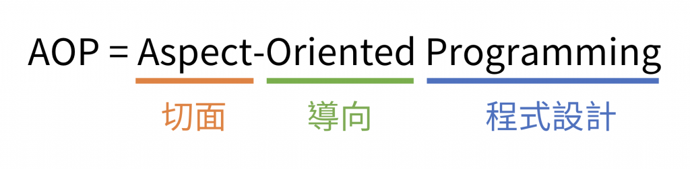

### 例子：測量時間的故事
如果我們想要去測量執行這個 print() 方法需要多長的時間，那我們可以在這個方法的最前面和最後面，去記錄當下的開始時間和結束時間，最後就可以去計算出 print() 方法總共執行了多久
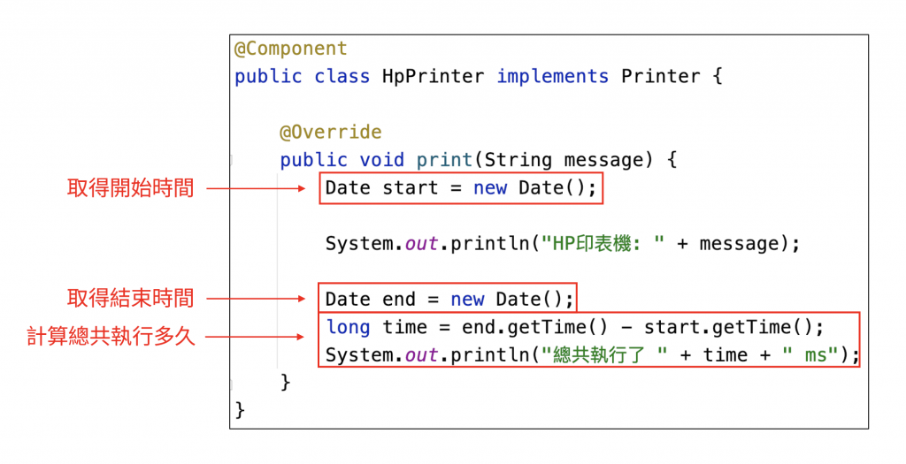

雖然我們透過上面的寫法，是可以去測量 print() 方法的運作時間沒錯，但是大家如果觀察一下這段程式的話，就可以發現在這個 print() 方法裡面，充斥了許多跟「印東西」這個功能無關的程式

像是這個 print() 方法，他本來要做的事情，其實只是在 console 上面輸出「HP 印表機: ....」的這一行資訊而已，但是因為我們想要去測量時間，所以就加了很多不相關的程式進去，進而讓這個方法變得很複雜，不利於後續的程式維護

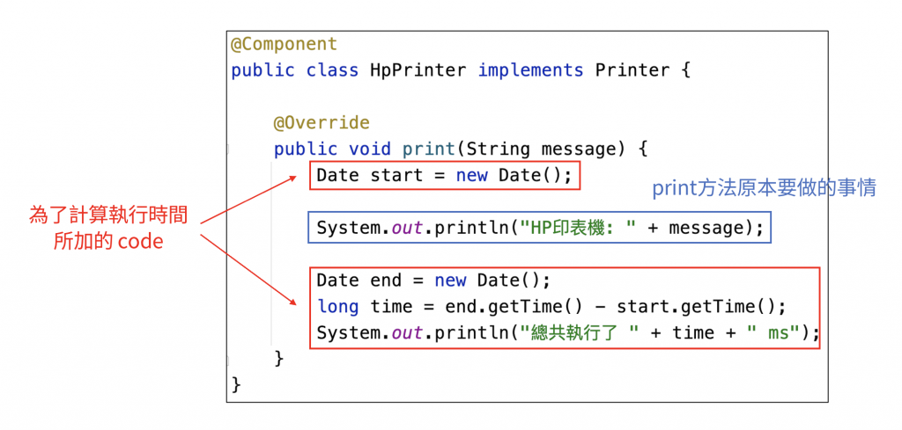

而且這樣子寫還會有一個衍生的問題，譬如說我們在 HpPrinter 裡面多新增了一個方法 printColor()，然後我們也想要去測量這個 printColor() 方法的時間的話，那我們就得複製貼上所有測量時間的程式到 printColor() 方法裡面

現在只有這兩個方法要測量時間，所以這樣複製貼上可能覺得還好，但是如果當很多方法都需要測量執行時間的時候，這樣子的複製貼上就不會是一個好選項

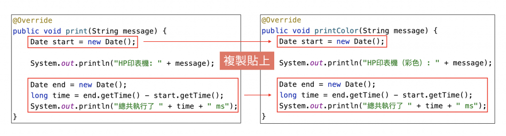

### 透過 AOP（切面）來輔助
我們可以來用一張圖來看一下，Spring AOP 是如何解決上面那個複製貼上的問題的

如果我們把剛剛的 HpPrinter 畫成圖的話，就會變成是下面這個樣子：

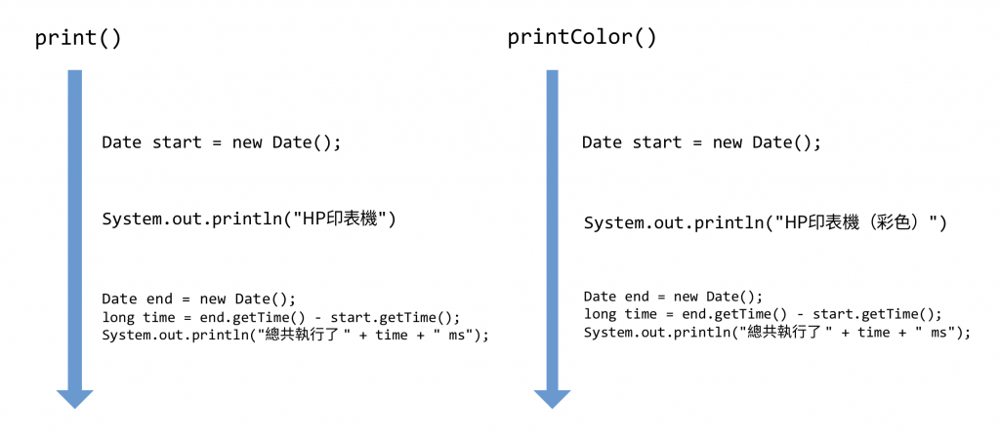

在上圖中呈現了 HpPrinter 中的 2 個方法：print() 和 printColor()，每一個箭頭代表的是一個方法，而箭頭右邊的程式碼就是這個方法裡面所寫的程式

在這張圖也可以看到，在這兩個方法裡面，最一開始都會去記錄方法的開始時間，後面則是去記錄方法的結束時間，最後並且把結束時間和開始時間相減，去取得這個方法的執行時間

那這時候，Spring AOP 就提出一個想法了，既然這些測量時間的程式是每個方法都要使用的共同邏輯，那我們就把這些程式，去獨立出來成一個「切面」，**由這個切面去橫貫所有的方法，替他們做測量時間的部分**

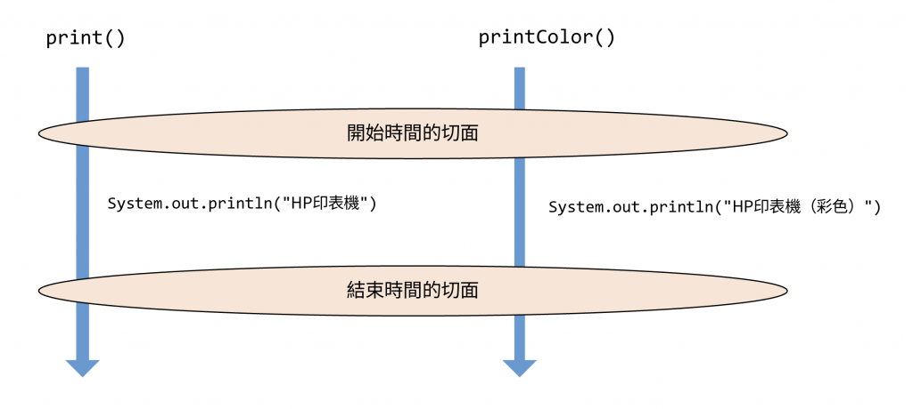

所以當我們使用了 Spring AOP 之後，我們就不用在方法裡面加上任何測量時間的程式了！我們只要將測量時間的共同邏輯，統一的交給切面去做處理，這個切面會去橫貫所有的的方法，分別去測量每一個方法的執行時間，所以每個方法就只要專注在各自要做的事情就好，世界和平！！

而這樣子使用切面的寫法，就會稱作是 **AOP**，也就是 **Aspect-Oriented Programming** (切面導向程式設計)


## 製造切面的方法：@Aspect

在使用 `@Aspect` 去創建新切面時，一定要特別注意，只有 Bean 才可以變成一個切面，所以換句話說的話，就是在使用 `@Aspect` 時，也要同時使用 `@Component`，將該 class 變成 Bean 的同時，切面的設定才會生效，如果只有在 class 上面加上 @Aspect 的話，是完全沒有任何效果的！

反正無論如何，大家只要記得，在使用切面時，**需要「@Component 和 @Aspect 要一起使用」就對了**

## 如何解讀 AOP 程式？

### 步驟一：先閱讀 @Before 小括號中的程式

在 `@Before` 後面的小括號中的程式，稱為「切入點 (Pointcut)」，即是去指定哪個方法要被切

舉例來說，假設我們想要測量的是 HpPrinter 中的方法的時間，那麼切面就是測量時間的程式，而 HpPrinter 中的方法，就是切入點 (Pointcut)

所以在 `@Before` 後面的小括號中的程式，即是去指定「切入點 (Pointcut)」，表示我們想要讓哪個方法，最後會被 MyAspect 這個切面所切

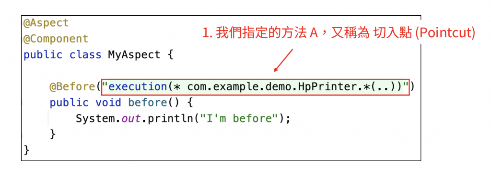

### 步驟二：查看前面的註解是什麼
確認好了切入點之後，接著就是查看前面所加上的註解是什麼，像是這邊所加上的，就是 @Before，而 @Before 的用途，就是指定要在小括號中的切入點 「執行前」，去執行下面的 before() 方法

所以簡單的說的話，前面的這個 @Before，他指定的就是 「時機點」，@Before 對應的就是切入點方法「執行前」執行，AOP 還有提供其他時機點的不同註解，像是 @After 和 @Around，後續也會再跟大家做介紹

因此在步驟二這裡，就是去確認「切面方法執行的時機點」

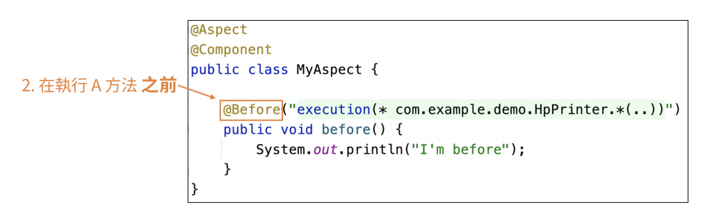

### 步驟三：要執行的切面方法

當我們確認好「切入點」和「時機點」之後，最後就是在下面的 before() 方法中，去撰寫切面的程式

像是在這裡我們就只在 before() 方法裡面寫上一行程式，去輸出「I'm before」的資訊到 console 上

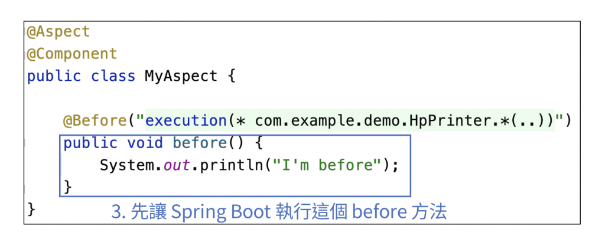

### 小結:綜合上述三的步驟
所以綜合上述的三個步驟，就可以去解讀這一段 AOP 的程式的含義是什麼了

* 步驟一：我們指定了「切入點為 HpPrinter 中的所有方法」
* 步驟二：在切入點的方法「執行之前」
* 步驟三：執行下面的 before() 方法

### 其他用法：@After、@Around

在 Spring AOP 裡面，有三種時機點可以選擇：

* @Before：在方法「執行前」執行切面
* @After：在方法「執行後」執行切面
* @Around：在方法「執行前」和「執行後」，執行切面

### 切入點 (Pointcut) 怎麼撰寫？
在前面的程式中，我們有在 @Before 後面加上一段看起來很長的程式，那一段程式就是在指定方法的切入點為何
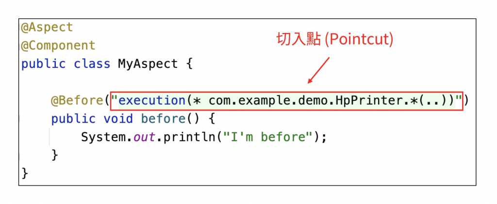

由於這個切入點寫起來還滿複雜的，而且使用頻率也不是很高，因此就建議大家有用到的時候再去查詢就可以了，以下提供幾種常見的寫法邏輯給大家：

1. 切入點為 com.example.demo.HpPrinter 底下的 print() 方法
```java
execution(* com.example.demo.HpPrinter.print())
```
2. 切入點為 com.example.demo.HpPrinter 底下的所有方法
```java
execution(* com.example.demo.HpPrinter.*(..))
```
3. 切入點為 com.example.demo 這個 package 中的所有 class 的所有方法（不包含子 package）
```java
execution(* com.example.demo.*(..))
```
4. 切入點為 com.example.demo 這個 package 及其底下所有子 package 中的所有 class 的所有方法
```java
execution(* com.example.demo..*(..))
```
5. 切入點為那些帶有 @MyAnnotation 的方法
```java
@annotation(com.example.demo.MyAnnotation)
```
### Spring AOP 的發展

pring AOP 以前最常被用在以下三個地方：

1. 權限驗證 
2. 統一的 Exception 處理 
3. log 記錄

但是由於 Spring Boot 發展逐漸成熟，因此上述這些功能，都已經被封裝成更好用的工具讓我們使用了，所以大家目前已經比較少直接使用 `@Aspect` 去創建一個切面出來了

舉例來說，像是權限驗證這一塊，我們就會改成使用 Spring Security 這個工具來完成，不過 Spring Security 的底層仍舊是透過 Spring AOP 來完成的，只是 Spring Security 把他封裝得更好、使用上更方便，因此在進行權限驗證時，使用 Spring Security 是更能提升大家開發的效率的

所以雖然 Spring AOP 已經漸漸淡出大家的日常使用，不過他作為 Spring 框架中的重要特性之一，還是常常生活在我們周邊的，只是我們可能感覺不太到而已XD

因此上述所介紹的 Spring AOP 的相關用法，大家就有個印象就可以了，重點是要把 AOP 的切面概念搞懂，至於其他的 `@Before`、`@After`、`@Around` 的用法，就有個印象就可以了

## Url 路徑對應：@RequestMapping

如果想要將這個 /test 的 url 路徑，去對應到 Spring Boot 的方法上的話，我們就只要使用 @RequestMapping 這個註解就可以達成了！

譬如說當我們在 MyController 中的 test() 方法上，去加上 @RequestMapping，並且在後面的小括號中指定 url 路徑的值 /test，這樣就可以成功將 url 路徑 /test 給對應到下面的 test 方法上

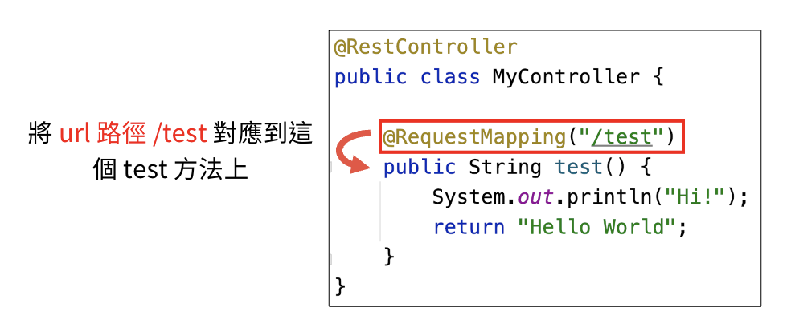

### 使用 @RequestMapping 的注意事項
在使用 @RequestMapping 去指定 url 路徑的對應時，是有一個非常重要的注意事項，**就是該 class 上面一定要上加 @Controller 或是 @RestController，否則 @RequestMapping 不會生效**

## @Controller 和 @RestController 的差別在哪裡？
@Controller 和 @RestController 的用途有點類似，不過他們是有一些細微的差別的，以下是他們的共同點和差別：
* 共同點：都可以將 class 變成 Bean、也都可以將裡面的 @RequestMapping 生效
* 差別：
  * @Controller：將方法的返回值自動轉換成 前端模板的名字
  * @RestController：將方法的返回值自動轉換成 Json 格式

> 在以前的古老時代，通常都是用 @Controller 來選擇要返回的前端模板給使用者，不過隨著前後端分離的盛行、以及 Json 格式的崛起，因此目前大部分的程式都是使用 @RestController 來實作了 
> 所以大家後續如果需要使用的話，建議優先使用 @RestController 來回傳 Json 格式，而 @Controller 則是有搭配 jsp、thymeleaf...等等這類的前端模板引擎時，再考慮去使用

## 在 Spring Boot 中接住參數的四個註解
在 Spring Boot 中，有四個註解可以去接住前端的參數，分別是：

### 1. @RequestParam
接住那些放在 url 後面的參數

#### 如何運用 @RequestParam？
舉例來說，假設我們今天使用了 GET 請求，並且在 url 的最後面，加上一個 id=123 的參數的話，那麼實際的 url 就會長得像是這個樣子

```json
http://localhost:8080/test1?id=123
```

那麼當前端透過這個格式，傳遞 id=123 的參數的值來的話，在 Spring Boot 這邊，就只需要在 test1() 方法中，去新增一個 Integer 類型的參數 id，並且在這個參數的前面，去加上一個 `@RequestParam`

### 2. @RequestBody
就是去 **「接住放在 request body 中的參數」**，像是上面的 POST 方法在傳遞參數時，就是把參數放在 request body 中來傳遞

因此如果我們想要去接住這些放在 request body 中的參數的話，那麼就是要使用 @RequestBody 才能接住！

### 3. @RequestHeader
**接住那些放在 request header 中的參數**

### 4. @PathVariable
一樣是上面的例子，假設我們今天有一個 url 如下
```json
http://localhost:8080/test4/123
```
並且我們在 Spring Boot 裡面，想要去取得到 url 路徑 /test4/123 中的 123 的值的話，那我們必須要做以下這兩件事情：

首先是在使用 @RequestMapping 去定義 url 路徑時，先將 url 路徑定義成 "/test4/{id}"，這樣到時候 Spring Boot 就能夠把上述的 url，去給對應到 test4() 方法上

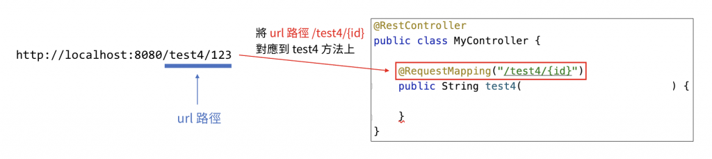

接著，就是在 test4() 的方法中，去添加一個 Integer 類型的參數 id，並且在這個參數的前面，去加上一個 `@PathVariable`

這樣到時候，這個 id 的值就會是 123，因此我們就成功的取得到 url 路徑中的 {id} 的值了！

### 小結：在 Spring Boot 中接住參數的四個註解
1. `@RequestParam`：接住放在 Url 後面的參數
2. `@RequestBody`：接住放在 request body 中的參數
3. `@RequestHeader`：接住放在 request header 中的參數
4. `@PathVariable`：取得放在 url 路徑中的值


